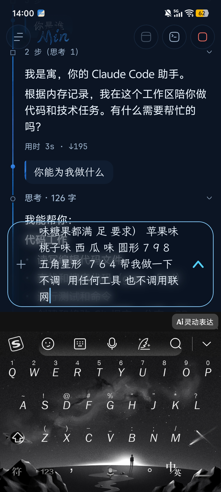
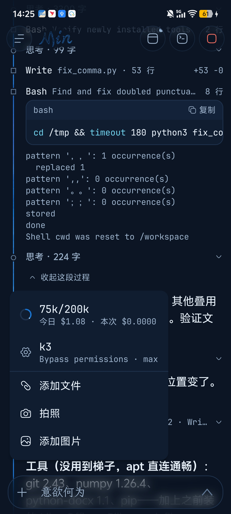
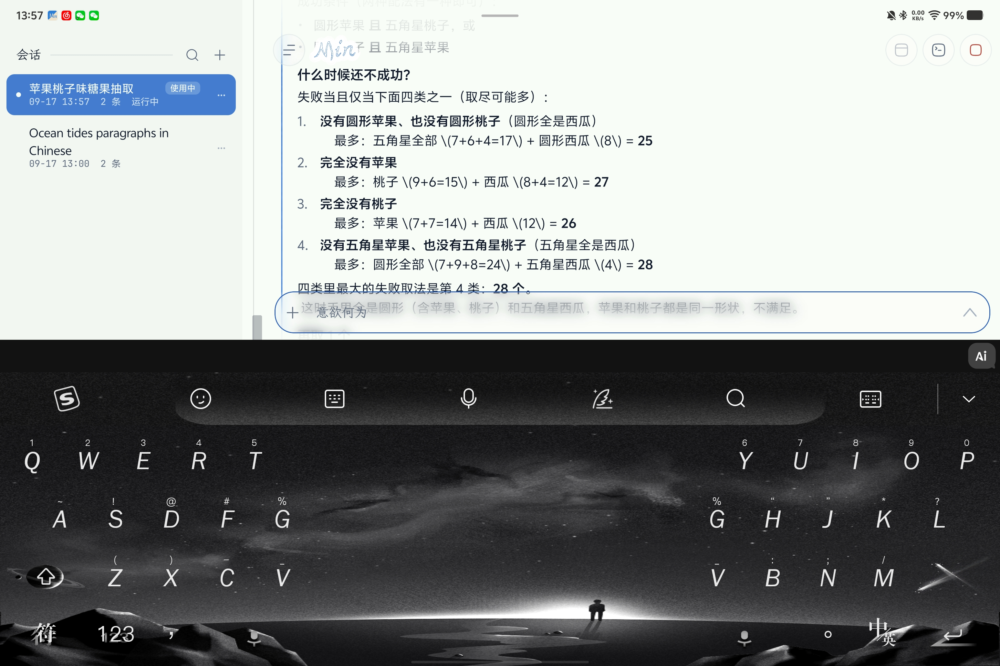

# Min

Unofficial Android client that runs the official **Claude Code CLI** inside Ubuntu on device (proot).
No root required. Phones and tablets.

**Not affiliated with, endorsed by, or sponsored by Anthropic.** You bring your own API token or relay.

把官方 **Claude Code CLI** 装进 Android 上的 Ubuntu（proot）里，用一个像工作日志的界面驱动它。
不需要 root。手机、平板都能用。需自备 Anthropic / 中转 token。

## 它做了什么

- 三步向导：填 token / 中转地址 → 下载 Ubuntu 24.04 基础镜像（约 30 MB，官方源连不上自动换镜像）→
  装 Node.js 22 + `@anthropic-ai/claude-code`（原生二进制由 App 自己断点续传下载并按官方 sha512 校验）
- 会话：多会话、流式输出、工具调用折叠卡、权限确认 / AskUserQuestion / 计划模式、checkpoint 撤销、
  模型 / 权限模式 / effort / cwd 热切、斜杠命令、`@` 文件、图片
- 后台：前台服务保活（对 OEM ROM 拒绝的情况有降级），等待审批 / 完成 / 中断的通知，通知上直接允许 / 拒绝
- 环境：文件页（导入 / 导出 / 分享 / 编辑）、真终端（Termux terminal-view）、CLI / apt 更新、重装
- 平板 / 横屏：会话列表常驻左栏

## 界面

视觉与动效规范在 `DESIGN.md`（「海」：纸 / 墨 / 海）。界面上没有"蓝色"这个色值——每一块蓝都是把纸镂空成那个形状、
盖在一张酒精墨蓝纹理上的窗；整屏共用一片海，滚动时纸在海上滑，倾斜手机时海在纸下错位。桌面图标是两色对角线的 Min（Cormorant Garamond 斜体，沙/海）。

<p align="center">
  
  
  
</p>

## 构建

```bash
./gradlew :app:assembleDebug
```

需要 Android SDK（`local.properties` 里 `sdk.dir`）、**JDK 17**。产物在 `app/build/outputs/apk/debug/`，
装 `app-arm64-v8a-debug.apk`（手机 / 平板）或 `app-x86_64-debug.apk`（模拟器）。

单元测试：`./gradlew :app:testDebugUnitTest`

首次在设备上使用时，向导还会再下载 rootfs / Node / CLI（体积与网络视镜像而定），与编译 APK 是两回事。

## 目录

```
app/        dev.min.code —— UI、会话协议、安装器、设置、服务
workspace/  proot 启动、rootfs 安装、假 /proc 与 /dev/shm、pty
highlight/  语法高亮
tools/      build_sea_assets.py、uitap.py（模拟器按文字点按钮）
```

## 许可证

**AGPL-3.0**（见 `LICENSE`）。第三方代码与字体署名见 `NOTICE`。

Claude Code is a product of Anthropic, PBC. This project only drives the publicly distributed CLI with credentials you supply.
